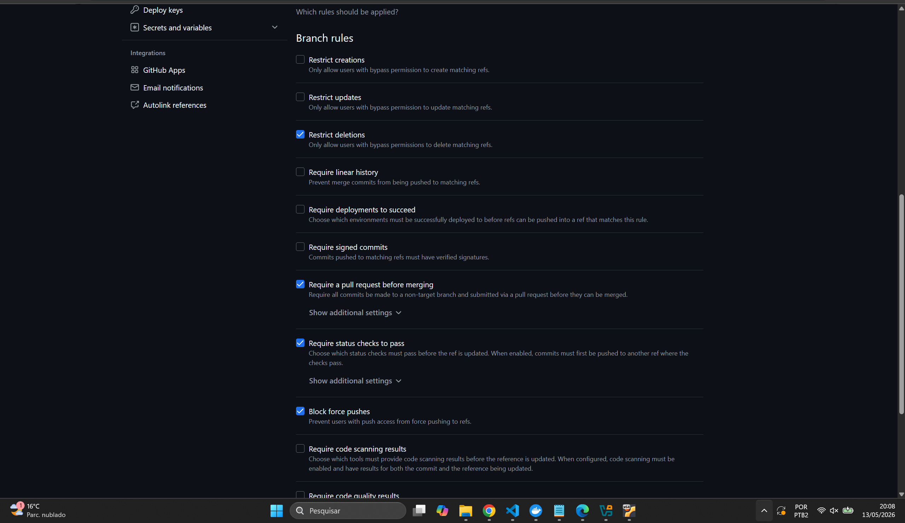

# ConectaCAE

Sistema acadêmico voltado ao apoio psicológico e à organização de atendimentos no CAE. O projeto está dividido em um backend em Django REST Framework e um frontend em Angular, com foco em cadastro de usuários, controle de grupos e permissões, agenda de horários, registro de atendimentos e publicação de comunicados.

---

## Visão Geral

De forma geral, a aplicação reúne funcionalidades para:

- cadastrar e manter usuários internos do sistema;
- organizar grupos de usuários e níveis de permissão;
- registrar estudantes atendidos;
- disponibilizar horários e agendamentos de atendimento;
- registrar prontuários e históricos de atendimento;
- publicar comunicados para grupos específicos;
- consolidar informações resumidas no dashboard.

A proposta do projeto é centralizar rotinas administrativas e de acompanhamento em uma única interface web.

---

## Estrutura do Projeto

```txt
ApoioPsicologicoCAE/
├── backend/      API em Django + Django REST Framework
├── frontend/     Aplicação web em Angular
├── .github/      Workflows do GitHub Actions
├── README.md
```

---

## Backend

O backend expõe endpoints REST sob o prefixo `/api/` e está organizado por domínios:

- `usuarios` → gestão de usuários e grupos;
- `permissoes` → controle de permissões e níveis de acesso;
- `estudantes` → cadastro básico de estudantes;
- `agenda` → horários disponíveis e agendamentos;
- `atendimentos` → registros e prontuários de atendimento;
- `comunicados` → avisos internos vinculados a grupos;
- `auditoria` → rastreio de ações realizadas.

---

## Tecnologias Utilizadas

### Backend

- Python
- Django REST Framework
- JWT Authentication
- PostgreSQL
- Django CORS Headers

### Frontend

- Angular 21
- Angular Material
- TypeScript
- RxJS

---

## Pré-requisitos

Antes de executar o projeto, tenha instalado:

- Python 3.13 ou superior
- Node.js 20 ou superior
- npm
- PostgreSQL

---

# Como Rodar o Backend

## 1. Acesse a pasta do backend

```bash
cd backend
```

## 2. Crie e ative o ambiente virtual

### Windows

```bash
python -m venv .venv
.\.venv\Scripts\Activate.bat
```

---

## 3. Instale as dependências

```bash
pip install -r requirements.txt
```

---

## 4. Configure o banco PostgreSQL

Nas configurações atuais do projeto, o backend espera um banco com os seguintes dados:

```txt
Banco: conectacae
Usuário: postgres
Senha: 123
Host: localhost
Porta: 5432
```

Caso utilize outras credenciais, ajuste o arquivo:

```txt
backend/conectacae/settings.py
```

---

## 5. Execute as migrations

```bash
python manage.py makemigrations
python manage.py migrate
```

---

## 6. Inicie o servidor

```bash
python manage.py runserver
```

O backend ficará disponível em:

```txt
http://localhost:8000/
```

A API estará disponível em:

```txt
http://localhost:8000/api/
```

---

# Como Rodar o Frontend

## 1. Acesse a pasta do frontend

```bash
cd frontend
```

---

## 2. Instale as dependências

```bash
npm install
```

---

## 3. Inicie o servidor Angular

```bash
npm start
```

O frontend ficará disponível em:

```txt
http://localhost:4200/
```

---

## Pipeline CI/CD

O projeto utiliza GitHub Actions para automação de integração(CI/CD).

O pipeline realiza automaticamente:

- instalação de dependências;
- validação do backend Django (system checks e migrations pendentes);
- execução de testes automatizados em matriz (Python 3.12 e 3.13);
- integração com PostgreSQL em container Docker;
- empacotamento do backend como artefato (`tar.gz`);
- build e publicação da imagem Docker no Docker Hub (tags `:latest` e `:SHA do commit`).

As credenciais utilizadas no pipeline são armazenadas de forma segura utilizando GitHub Secrets.

---

## Imagem Docker

A imagem do backend é construída e publicada automaticamente pelo pipeline a cada push na branch `main`.

🐳 **Docker Hub:** https://hub.docker.com/r/kuhnenz/apoiopsicologicocae

---

## Estratégia de Branches

O projeto utiliza organização de branches baseada em separação entre desenvolvimento e produção.

### Branches utilizadas

- `main` → versão estável do sistema;
- `develop` → integração de funcionalidades em desenvolvimento;

---

## Integrantes

- Eduardo Zirbell
- Guilherme Kuhnen
- Kamilly Birkner
- Kauana Correia
- Lucas Eduardo

---

## GitHub Actions

Os workflows da aplicação estão localizados em:

```txt
.github/workflows/
```

Atualmente o projeto possui pipeline automatizado para validação do backend Python/Django.

---

## Observações

- O projeto utiliza PostgreSQL como banco principal.
- O backend utiliza autenticação JWT.
- O frontend consome a API REST disponibilizada pelo backend.
- O pipeline falha automaticamente caso testes ou validações apresentem erro.

---

# Relatório do Trabalho

Documentação das questões propostas pelo professor no enunciado do trabalho de Infraestrutura de TIC.

---

## Tarefa 3 — O que acontece se um teste falhar propositalmente?

Quando um teste falha, o pipeline do GitHub Actions é interrompido automaticamente e o workflow é marcado como **failed**. Dessa forma, o código não é considerado válido para integração na branch principal até que o erro seja corrigido. Isso garante maior confiabilidade na aplicação, evitando que alterações com problemas sejam enviadas para produção.

---

## Tarefa 4 — Em que cenário real a publicação de artefatos seria útil?

A publicação de artefatos é útil para armazenar arquivos gerados durante o processo de build, como pacotes, executáveis ou versões compiladas da aplicação. Em cenários reais, isso permite que equipes de QA, homologação ou deploy baixem os arquivos diretamente do pipeline sem precisar recompilar o projeto manualmente.

---

## Tarefa 5 — Por que nunca devemos commitar credenciais no código?

Credenciais nunca devem ser armazenadas diretamente no código-fonte porque isso pode expor informações sensíveis, como senhas, tokens e chaves de acesso. Caso o repositório seja compartilhado ou publicado, essas informações podem ser utilizadas indevidamente por terceiros, comprometendo a segurança da aplicação e dos dados. Por esse motivo, o projeto utiliza **GitHub Secrets** para armazenar credenciais de forma segura no pipeline CI/CD.

---

## Tarefa 6 — Qual versão apresentou alguma diferença de comportamento, se houver?

Não foram identificadas diferenças de comportamento relevantes entre as versões utilizadas (Python 3.12 e 3.13).

---

## Tarefa 7 — Regra de proteção de branch

A branch `main` foi configurada com regra de proteção exigindo:

- Abertura de Pull Request para qualquer alteração;
- Aprovação dos status checks do pipeline antes do merge (`lint`, `test` 3.12/3.13 e `build`);
- Bloqueio de push direto, garantindo que nenhum código entre na `main` sem validação automatizada.

Print do painel de configuração:



---

## Tarefa 8 — Por que paralelismo importa em pipelines de CI?

O paralelismo permite executar múltiplos jobs simultaneamente, reduzindo o tempo total de execução do pipeline. Em ambientes reais, isso acelera validações, testes e builds, permitindo feedback mais rápido para a equipe de desenvolvimento e aumentando a produtividade.

---

## Tarefa 9 — Qual a diferença entre uma tag `latest` e uma tag por SHA? Quando usar cada uma?

A tag `latest` representa a versão mais recente da imagem Docker publicada no repositório. Já a tag baseada no SHA do commit identifica exatamente qual versão do código gerou aquela imagem, garantindo rastreabilidade e maior controle de versões.

A tag `latest` é útil para ambientes de desenvolvimento e atualização rápida, enquanto a tag SHA é mais indicada para produção e auditoria, pois permite reproduzir exatamente a versão utilizada.

---

## O que aprendemos e dificuldades encontradas

Durante o desenvolvimento do trabalho, foi possível compreender melhor o funcionamento de pipelines CI/CD utilizando GitHub Actions e integração com banco de dados em containers Docker.

O trabalho permitiu aproximar o desenvolvimento acadêmico de práticas reais utilizadas em ambientes profissionais de DevOps.

